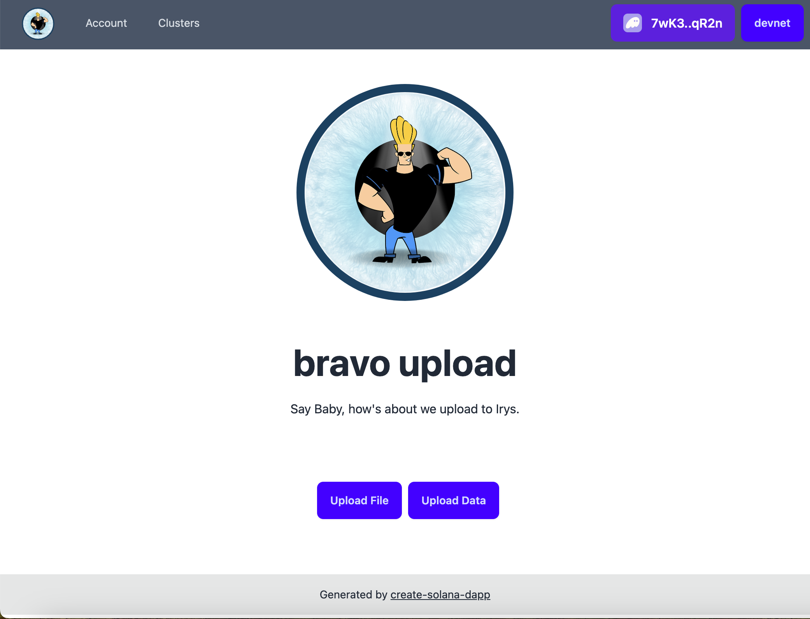
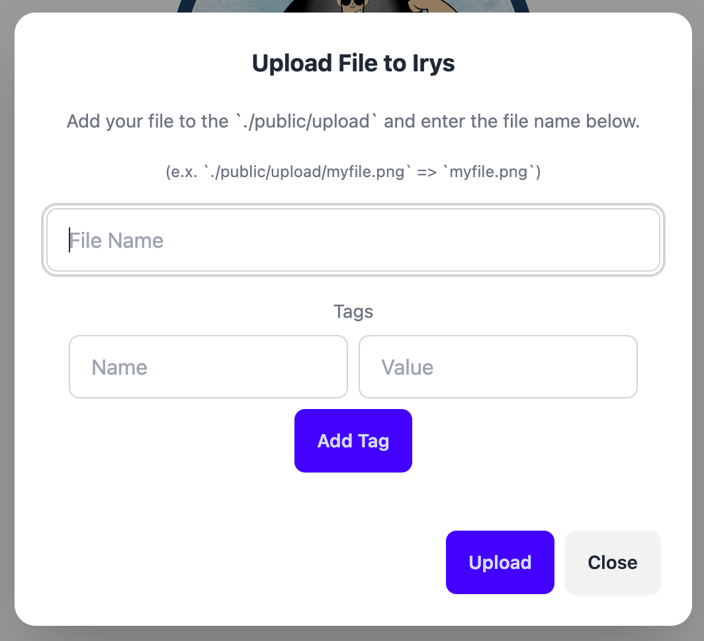
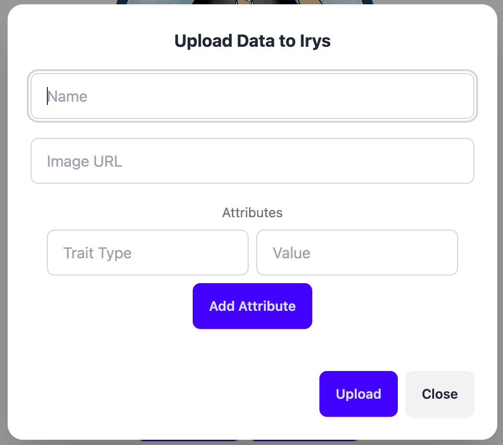

# Bravo Upload - Irys Upload UI

This is a simple UI intended for local use. The app will upload files and data to Irys, funding the node with SOL on Solana Devnet.

The main goal for building this was to provide a an easy way to upload the necessary data to create an NFT on Solana.

<!-- insert an image of the bravo_upload_logo.svg -->



Irys configurations can be changed in the `Irys` instance located in the respective API route.

This project is generated with the [create-solana-dapp](https://github.com/solana-developers/create-solana-dapp) generator and Irys routes built from the [Irys Developer Docs](https://docs.irys.xyz/developer-docs/irys-sdk).


## Getting Started

### Prerequisites

- Node v18.18.0 or higher
- Base58 Private Key w/ Devnet SOL in the Account


### Installation

#### Clone the repo

```shell
git clone <repo-url>
cd <repo-name>
```

#### Install Dependencies

```shell
npm install
```

#### Start the web app

```
npm run dev
```

### Uploading Files

To upload a file you first need to place it in the `/public/upload` folder, then provide the file name inside the input.

```shell
ex: johnnybravo.png
```

You can also provide tags that will be stored alongside the image on Irys.

```shell
ex: { name: "application-id", value: "MyNFTDrop" }
```

When uploading, Irys will calculate the size of the file and fund the node accordingly with the keypair provided in `.env`. The logic for this can be seen within `/api/irys/upload/file/route.tsx`/

When complete, a link to the upload will be provided.
https://devnet.irys.xyz/RmuMJzZLeZ5uoPRZi4PEJyrBIK0pt8UdqOl3a0vpbIo
```shell
ex: https://devnet.irys.xyz/RmuMJzZLeZ5uoPRZi4PEJyrBIK0pt8UdqOl3a0vpbIo
```



### Uploading Data

The data upload functionality is configured specifically for NFT metadata, however the logic can easily be adjusted to accomodate your storage needs and is located in `/api/irys/upload/data/route.ts`.

The UI takes in name, image url, and set of attributes to upload to Irys as a JSON string. When complete a link is returned to the Metadata URI.

```shell
ex: https://gateway.irys.xyz/-mpn67FnEePrsoKez4f6Dvjb1aMcH1CqCdZX0NCyHK8
```

